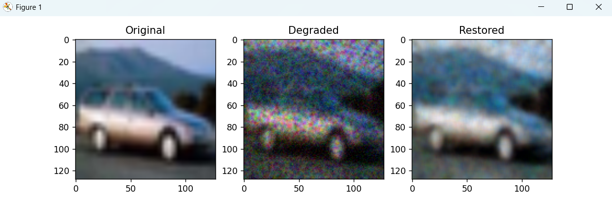
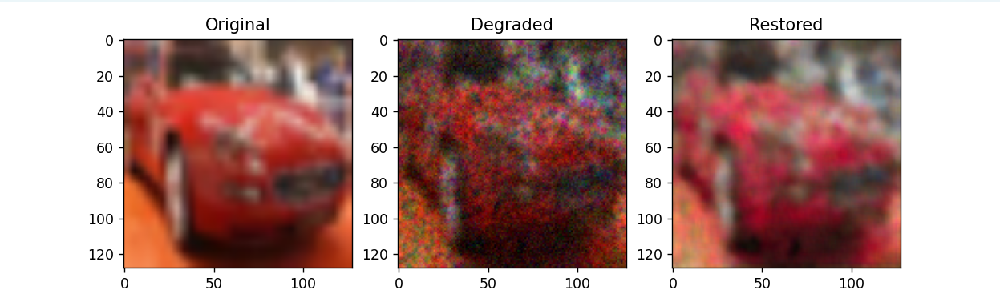
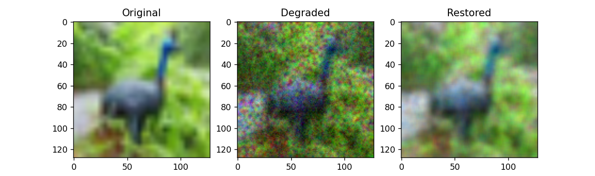
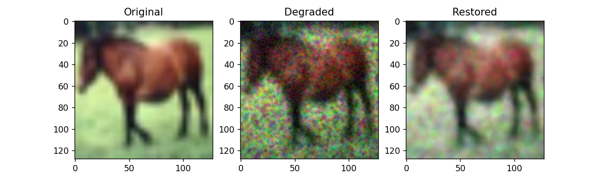

## Sample 1

**Metrics:**
- Baseline PSNR: 16.47
- CNN PSNR: 26.81
- CNN SSIM: 0.810 

**Analysis:**
The baseline gives around 16 dB, which is low-quality output. My CNN improves it to nearly 27 dB, which is a large improvement. The SSIM of 0.81 shows that the structure of the image is well preserved, meaning the restored image is visually much closer to the original.

---

## Sample 2

**Metrics:**
- Baseline PSNR: 17.25
- CNN PSNR: 23.70
- CNN SSIM: 0.734 

**Analysis:**
In this case, the CNN improves PSNR by about 6.5 dB, which shows noticeable enhancement over the baseline. The SSIM of around 0.73 indicates that the structure is preserved, but some details are smoothed out, so performance is moderate compared to stronger cases.

---

## Sample 3

**Metrics:**
- Baseline PSNR: 15.89
- CNN PSNR: 24.87
- CNN SSIM: 0.737

**Analysis:**
The baseline gives low PSNR (~15.9 dB), meaning the image is still very noisy. My CNN improves it to ~24.9 dB, which is a strong improvement. The SSIM of 0.73 shows that the structure is preserved, although some fine details are smoothed.

---

## Sample 4

**Metrics:**
- Baseline PSNR: 15.49
- CNN PSNR: 24.12
- CNN SSIM: 0.792

**Analysis:**
The baseline gives around 15 dB, which is poor quality. My CNN improves it to about 24 dB, showing a strong enhancement. The SSIM of ~0.79 indicates that the structure of the image is well preserved, so the output is visually much closer to the original.

